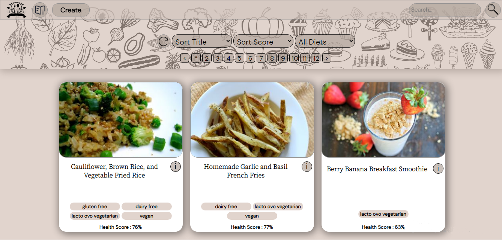

# Proyecto Individual - Henry Food

> Este proyecto consiste en una aplicación web que utiliza datos de la API externa [Spoonacular](https://spoonacular.com/food-api) y en la que se puede visualizar distintas Recetas de Comidas junto con su información más relevante.

 

  

 

## Características del Proyecto

- Filtro por Dietas.
- Ordenamientos por Score y Alfabético.
- Búsqueda de recetas por su nombre.
- Paginado.
- Carta de cada receta con información general.
- Detalle de recetas con información más detallada.
- Formulario controlado con JavaScript y HTML para la creación de una nueva receta.

 

## Tecnologías empleadas

**Front-end:**

- ReactJS
- Redux
- CSS puro
- Figma

**Back-end:**

- NodeJS
- Express
- Sequelize
- PostgreSQL
